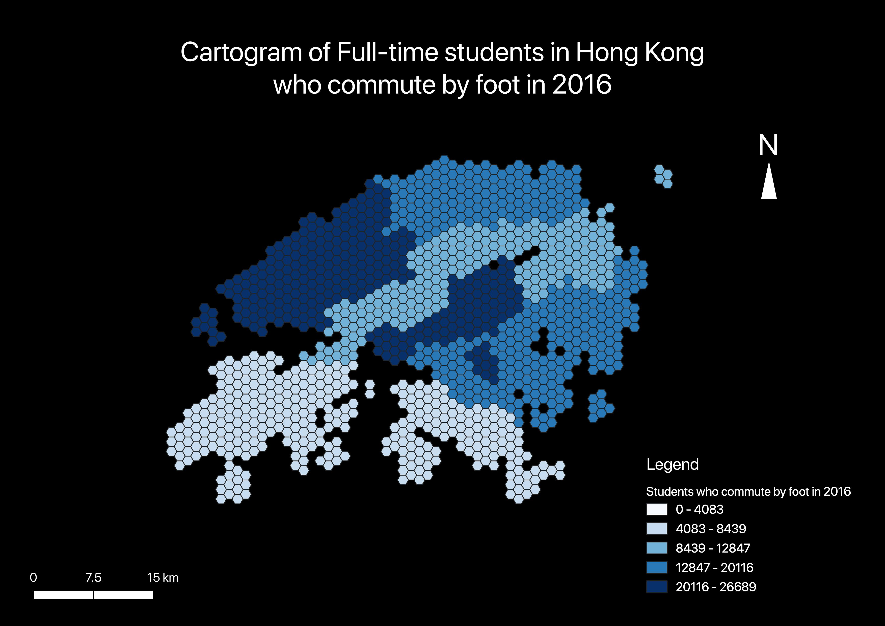
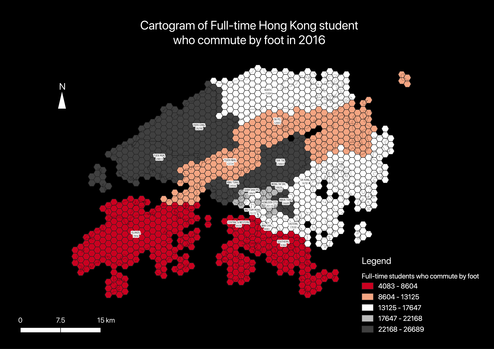
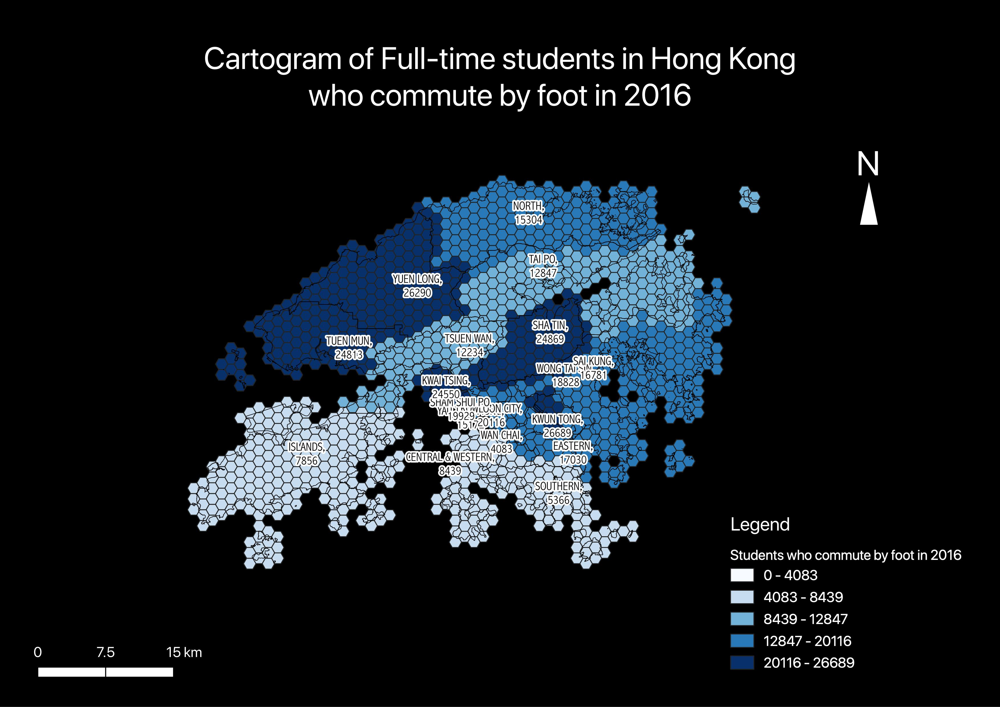
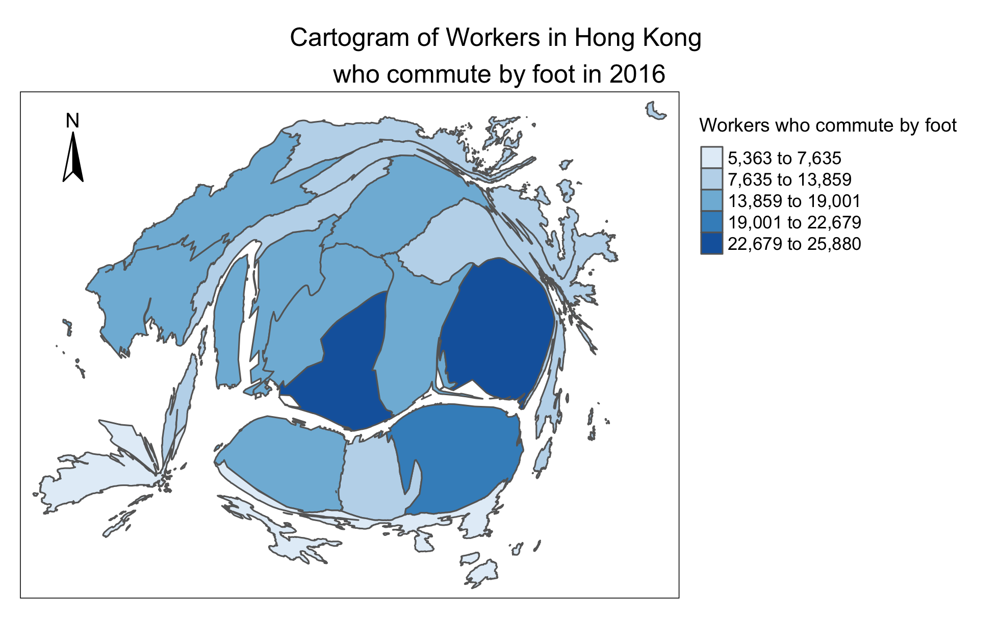

#As sources of information, Crampton (2001) argues that cartographic practices should be treated as social construct; where we should be critical of how position of powers creates a visual subjective representation of the real world. Utilising cartograms created by Hong Kong’s 2016 by-census commuting data, this report will critically discuss the generation and creation of maps; looking at Hong Kong government’s data source, the workflows on GUI and line-based programme to create maps, and cartographic practice of cartograms generated.


#Cartogram Map from QGIS

#Cartogram with labels



##Hexabin cartogram created by QGIS
#aims not to distort the topography and create a balance comparison to the weight of the variables without the influence of topology. 


#Cartogram from R

#Topology distorted cartogram created by R

```{r Loading csv data to RMarkdown}
#Loading 'WorkingHK' csv Data to R
WorkingHK <- read.csv('work.csv')

#Delete unwanted variables, to only show the variable for 'foot'
df <- WorkingHK[ -c(2,3, 5:13) ]
```

```{r Spatial Data}

#Load packages for creating map
library(maptools)
library(RColorBrewer)
library(classInt)
library(sp)
library(rgeos)
library(tmap)
library(tmaptools)
library(sf)
library(rgdal)
library(geojsonio)

#Loading Shapefile of Hong Kong 
HKMapSF <- read_shape('Hong_Kong_18_Districts.shp')
qtm(HKMapSF)
```

Joining attribute table 'df' to the 'HKMapSF' and change map to 'sp'
```{r}
HKDataMap <- append_data(HKMapSF, df, key.shp = "ENAME", key.data = "X...district", ignore.duplicates = TRUE)

class(HKDataMap)
HKDataMapSP <- as(HKDataMap, "Spatial")
class(HKDataMapSP)

```

Plotting a Cartogram
```{r Cartogram}
#refernce cartogram function!
library(cartogram)
HK_sp_cont <- cartogram_cont(HKDataMapSP, "foot", itermax = 20)
tmap_mode("plot")
tm_shape(HK_sp_cont) + 
  tm_polygons("foot", 
        style="jenks",
        palette="Blues",
        title="Workers who commute by foot")+
  tm_layout(main.title = "Cartogram of Workers in Hong Kong \nwho commute by foot in 2016", main.title.position= "center", main.title.size = 1, legend.outside = TRUE, legend.outside.position = c("right", "bottom")) +
  tm_compass(position = c("left", "top"),type = "arrow")
tmap_save(filename='Cartogram.png')

```


Create as an Interactive Map
```{r}
library(shinyjs)
tmap_mode("view")
HK_sp_cont_1 <- HK_sp_cont[ -c(1:2) ]
tm_shape(HK_sp_cont_1) + tm_polygons("foot",style="jenks",palette="Blues",midpoint=NA, title="Cartogram of Hong Kong's \nworkers who commute by foot in 2016", alpha=0.75)
```

#The provision of interactivity on R provides an easy comparison to actual topography of Hong Kong and would not be affected by the labelling of different districts. Oppose to the labels seen in Figure 1, where QGIS display the label according to the zoom; figure 2 where the cartographer “forcefully” show all labels. Figure 3 has no labels and topography lines, does not provide the narrative fully